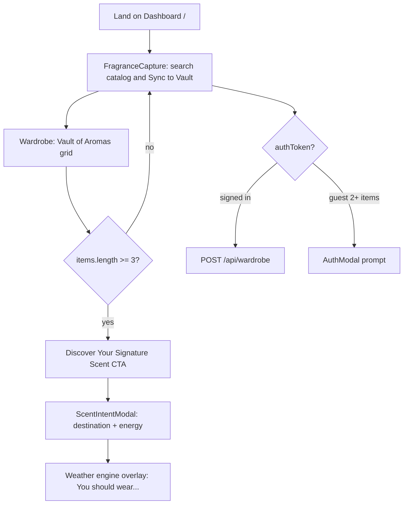

# Site Usability Fix Plan (ScentBeam / Scent Cast)

**Status:** Phase 0 research playbook. Theory and tradeoffs before UI implementation.
**Last updated:** 2026-05-25

## Cross-links

| Doc | Purpose |
|-----|---------|
| [AGENT_INDEX.md](./AGENT_INDEX.md) | Repo entrypoint and agent index |
| [RUNTIME_NAVIGATION_INDEX.md](./RUNTIME_NAVIGATION_INDEX.md) | Active routes, runtime calls, navigation baseline |
| [FRAGRANCE_SEARCH_CONTRACT.md](./FRAGRANCE_SEARCH_CONTRACT.md) | Search response shape, diagnostics, fallback behavior |

**Complementary, not superseded:** responsive polish handoffs in `handoffs/codex_beta_ui_bug_plan.md` and `handoffs/gemini_ui_validation_report.md`. Those are layout/breakpoint references and do not cover onboarding, copy clarity, or accessibility tokens.

---

## 1. Executive Summary And Principles

Scent Cast is a React 19 + Vite + Tailwind v4 frontend in `artifacts/scent-cast`. Current public routes are `/`, `/community`, and `/share/:userId` in `artifacts/scent-cast/src/App.tsx`. The dashboard is already functional, but new users can miss the core loop: add scents, build enough vault context, then run a weather + intent recommendation.

This playbook is the single source of truth for site-wide usability work. It maps actual behavior, separates current / possible / not yet possible, and keeps theory decisions visible so multiple agents converge on a minimal, high-impact approach before UI code changes.

### Principles

1. **Simplicity rule:** Prefer copy, labels, tokens, and empty-state CTAs over new routes, nav systems, or backend changes.
2. **No API contract changes:** Search behavior stays aligned with [FRAGRANCE_SEARCH_CONTRACT.md](./FRAGRANCE_SEARCH_CONTRACT.md) unless a separate backend task is opened.
3. **Luxury tone preserved:** Add plain-language clarity alongside brand voice; do not flatten the product into generic utility copy.
4. **Agent update protocol:** Each agent adds a dated [Decision Log](#decision-log) entry when theory or implementation status changes. Unresolved items stay in [Open Questions](#open-questions).

### App Scope (Verified)

| Item | Detail |
|------|--------|
| Frontend | `artifacts/scent-cast` - React 19 + Vite + Tailwind v4 |
| Routes | `/` dashboard, `/community`, `/share/:userId` - `artifacts/scent-cast/src/App.tsx` |
| Related contracts | [FRAGRANCE_SEARCH_CONTRACT.md](./FRAGRANCE_SEARCH_CONTRACT.md), [RUNTIME_NAVIGATION_INDEX.md](./RUNTIME_NAVIGATION_INDEX.md) |
| Prior UI handoffs | `handoffs/codex_beta_ui_bug_plan.md` - responsive polish only; does not cover onboarding/copy/a11y |

---

## 2. User Journey Map (Current Truth)

### Key Facts From Code Review

| Behavior | Where | Implication for UX |
|----------|-------|--------------------|
| Discovery CTA is hidden until **3+ vault items** | `artifacts/scent-cast/src/App.tsx` lines 337-357 | New users do not see the core value prop early. |
| Recommendation uses **weather + intent + vault** | `artifacts/scent-cast/src/context/WardrobeContext.tsx` `handleIntentComplete`, lines 950-955 | "How it works" must mention atmosphere + vault context, not generic search. |
| Hero search adds a new fragrance; wardrobe search filters the vault and image hints | `artifacts/scent-cast/src/components/FragranceCapture.tsx`; `artifacts/scent-cast/src/components/Wardrobe.tsx` `#wardrobe-vault-search`, lines 1396-1403 | Two visually similar fields serve different mental models. This is the root of "Add to Vault" ambiguity. |
| Guest vault works locally; auth nudge appears at **2+ items** | `artifacts/scent-cast/src/context/WardrobeContext.tsx` `handleAddItem`, lines 642-644 | Onboarding copy should say users can start as guests and sign in to save. |
| Search diagnostics exist but are not shown | [FRAGRANCE_SEARCH_CONTRACT.md](./FRAGRANCE_SEARCH_CONTRACT.md) lines 35-46 and 264-268 | "No feedback" is a UI visibility issue, not necessarily missing API data. |
| Dead code: hidden duplicate CTA with `alert()` | `artifacts/scent-cast/src/App.tsx` lines 382-394 | Safe cleanup candidate after replacement empty/gated messaging exists. |
| `not-found.tsx` exists but is unwired | `artifacts/scent-cast/src/App.tsx` routes lines 593-597 | Site-wide polish should include a catch-all 404 route or explicitly defer it. |

---

## 3. Audit: Three Pillars

Each finding maps to symptom, root cause, touch files, and open theory. These are not final UI choices yet.

### A. Navigation And Clarity

| Symptom | Root cause | Primary files |
|---------|------------|---------------|
| Hero tagline is intriguing but lacks a guided next step | Single long page; no onboarding block; discover CTA is gated | `App.tsx`, `AppTopNav.tsx` |
| Jargon such as Matrix, Saturation, Chronos, Archive Matches, Sync to Vault | Product vocabulary appears before the behavior is explained | `App.tsx` atmosphere bar, `FragranceCapture.tsx`, `Wardrobe.tsx` |
| Sparse nav exposes Community + auth/share only | IA is intentionally minimal | `AppTopNav.tsx` |

#### How-It-Works Theory Options

Agents should debate, then lock one option before Phase 1.

| Option | Description | Tradeoffs |
|--------|-------------|-----------|
| **A - Inline 3-step strip** | Under hero: add scents -> read atmosphere -> discover match | Lowest risk, no routing, best MVP fit. |
| **B - Sheet/modal** | Reusable from Community/Share and useful for longer copy | More code; better if copy exceeds about 3 lines or needs visuals. |
| **C - Section anchors in nav** | Vault / Add / Discover jump links | Helps power users; larger IA change. |

**Provisional recommendation:** Start with Option A for MVP. Escalate to Option B if the copy needs illustrations, onboarding depth, or reuse outside the dashboard.

#### CTA Theory

| CTA | Maps to existing behavior | Feasibility |
|-----|---------------------------|-------------|
| "Add your first scent" | `handleExpandArchive` focuses `#scent-add-to-vault-search` | **Now** - reuse `WardrobeContext.tsx` behavior. |
| "Explore scents" | Hero search or `/community` route | **Now** - clarify whether this means adding a scent or browsing Community. |
| "How it works" | No route today | **Now** as inline/modal; **not now** as a separate product-tour route. |
| "Discover..." before 3 items | Engine technically runs with 1+ items; UI hides until 3 | **Possible** as disabled CTA + progress, or lower the gate as a product decision. |

### B. Interactions And Feedback

| Symptom | Root cause | Primary files |
|---------|------------|---------------|
| "Add to Vault" can sound like search-only or final action | Search label, rotating examples, and "Sync to Vault" share one visual system | `FragranceCapture.tsx`, `VaultHeadlineRotation` |
| Search feedback feels weak while typing or after failed searches | `loadingStatus`, `errorStatus`, and `hasSearched` exist but are not always prominent enough | `FragranceCapture.tsx` |
| Empty vault feels unfinished | Empty copy is `text-white/10` with no CTA | `Wardrobe.tsx`, `SharePage.tsx` |
| Mid-size vault can feel sparse | "Tactical Selection" appears only at 10+ items | `Wardrobe.tsx` line 1513 |

#### Current / Possible / Not Yet Possible

| Capability | Status | Notes |
|------------|--------|-------|
| Typeahead/search against global DB from hero | **Current** | `searchFragrances` plus normalized match list. |
| Filter existing vault + image-hint solver | **Current** | Separate combobox in `Wardrobe`. |
| Show search degraded/fallback to user | **Not in UI** | Diagnostics are typed and preserved; degraded breadth depends on `fallback_source` key. |
| Discovery with fewer than 3 vault items | **Blocked by design** | UI gate is 3 items; engine only returns early at `items.length === 0`. |
| Rich onboarding tour | **Not built** | Would need new component/copy and possibly analytics. |
| Unified add/filter search | **Not recommended** | Different mental models. Differentiate labels and states instead of merging behavior. |

#### Interaction Fixes To Rank After Theory Lock

1. Differentiate labels: hero **"Look up a fragrance to add"** vs vault **"Search your collection"**. Keep DOM ids for tests and `handleExpandArchive`.
2. Make search states visible: loading text/spinner, "No matches", and a min-character hint before submit.
3. Improve empty vault with `components/ui/empty.tsx` pattern and a primary button that triggers `handleExpandArchive`.
4. Show discover progress when `items.length < 3`, for example a disabled CTA with "2 of 3 scents added".
5. Remove the hidden duplicate `alert()` block in `App.tsx` once replacement messaging exists.
6. Optionally surface `diagnostics.warning` in a small banner without changing API contracts.

### C. Accessibility

| Symptom | Evidence | Approach |
|---------|----------|----------|
| Low contrast empty/secondary text | `text-white/10`, `text-white/20`, `text-white/30` appear in vault/share/search surfaces | Add token floor in `index.css`, for example `--scent-text-muted: rgba(255,247,236,0.55)` for body-secondary text. |
| Tiny labels | `text-[7px]` through `text-[10px]` in `Wardrobe`, `SharePage`, and search/result labels | Set 11px (`0.6875rem`) floor for uppercase labels; preserve hierarchy through weight, spacing, and opacity. |
| Gradient-clipped button text | `.scent-primary-button-label` in `index.css` | Ensure a WCAG-friendly fallback such as solid `#fff7ec` under `@media (forced-colors)`, or drop background-clip for primary CTA labels. |
| Rotating examples inaccessible | `VaultHeadlineRotation` uses `aria-hidden` | Add visible "Example:" text or a single polite live region if the rotation remains informative. |
| Icon-only closes | Modals and image panels need consistent names | Add/verify `aria-label="Close"` or a specific close label sitewide. |
| Atmosphere jargon | Matrix, Saturation, Chronos, Coordinate | Make primary labels plain (Condition, Humidity, Time, Location); keep codenames as subtitles or accessible descriptions if desired. |

#### A11y Acceptance Targets

- Normal text: **4.5:1** contrast on `#030201`.
- Large text and UI components: **3:1** contrast.
- Verify at **320px** after changes, extending the style of checks from `handoffs/gemini_ui_validation_report.md`.
- Build gate: `corepack pnpm --filter @workspace/scent-cast run build`.

---

## Research Notes (2026-05-26 - Workstream C)

### Copy & Jargon Inventory

| Claim | Status | Evidence (path:lines) | UX implication |
|---|---|---|---|
| Jargon (Matrix, Saturation, Chronos, Coordinate) is used in the Atmosphere Bar marquee. | Confirmed | [App.tsx](file:///c:/Users/urban/my_project_workspace/huge_monorepo/artifacts/scent-cast/src/App.tsx#L129-L135) | These abstract terms are highly stylized. Users may struggle to understand what they measure without additional context or secondary labels. |
| "Sync to Vault" is the primary button CTA when adding a search result. | Confirmed | [FragranceCapture.tsx](file:///c:/Users/urban/my_project_workspace/huge_monorepo/artifacts/scent-cast/src/components/FragranceCapture.tsx#L842-L844) | The button text "Sync to Vault" conflicts slightly with the section header "Add To Vault", creating a minor cognitive load. |
| "Archive Matches" is the header for search results. | Confirmed | [FragranceCapture.tsx](file:///c:/Users/urban/my_project_workspace/huge_monorepo/artifacts/scent-cast/src/components/FragranceCapture.tsx#L776-L781) | "Archive" is confusing in modern UIs as it typically implies hiding/storing old files. In this context, it represents the catalog matches. |
| Atmosphere jargon is strictly local to App.tsx. | New finding | [App.tsx](file:///c:/Users/urban/my_project_workspace/huge_monorepo/artifacts/scent-cast/src/App.tsx#L129-L135) | Because the jargon does not appear in other views like `Wardrobe.tsx` or `SharePage.tsx`, simplifying these terms will only require localized edits in the Atmosphere Bar. |
| Discover gate hides the CTA until 3+ items are in the vault. | Confirmed | [App.tsx](file:///c:/Users/urban/my_project_workspace/huge_monorepo/artifacts/scent-cast/src/App.tsx#L337-L357) | Hiding the button completely prevents new users from seeing the main value proposition early. A progress-locked button is preferred. |
| Hidden dead CTA alerts on empty vault. | Confirmed | [App.tsx](file:///c:/Users/urban/my_project_workspace/huge_monorepo/artifacts/scent-cast/src/App.tsx#L382-L394) | Unused legacy section containing a duplicate CTA button with a browser alert should be cleaned up. |
| Empty vault state is vacant and lacks a CTA. | Confirmed | [Wardrobe.tsx](file:///c:/Users/urban/my_project_workspace/huge_monorepo/artifacts/scent-cast/src/components/Wardrobe.tsx#L1645-L1648) and [SharePage.tsx](file:///c:/Users/urban/my_project_workspace/huge_monorepo/artifacts/scent-cast/src/components/SharePage.tsx#L773-L776) | The vacant vault displays a static text with no guided next step. A CTA to trigger the search drawer should be added. |
| Guest auth nudge triggers when adding a second item. | Confirmed | [WardrobeContext.tsx](file:///c:/Users/urban/my_project_workspace/huge_monorepo/artifacts/scent-cast/src/context/WardrobeContext.tsx#L642-L644) and [App.tsx](file:///c:/Users/urban/my_project_workspace/huge_monorepo/artifacts/scent-cast/src/App.tsx#L556-L561) | When nextCount >= 2 for guest, the AuthModal pops up warning "Save your wardrobe before you lose it." This prevents data loss but could feel intrusive if not designed smoothly. |

### Journey Verification And Search Feedback (2026-05-25 - Workstream A-B)

| Claim | Status | Evidence (path:lines) | UX implication |
|---|---|---|---|
| Discover CTA is hidden until 3+ vault items. | Confirmed | `artifacts/scent-cast/src/App.tsx:331-357` | New users do not see the signature-scent loop until after adding 3 fragrances; progress-locked visibility would teach the loop earlier without changing backend behavior. |
| The engine itself can run below 3 items. | Confirmed | `artifacts/scent-cast/src/context/WardrobeContext.tsx:950-955` | Lowering the gate is a product decision, not an API constraint; the only hard runtime guard here is `items.length === 0`. |
| Guest auth nudge appears at 2+ items and allows dismissal. | Confirmed | `artifacts/scent-cast/src/context/WardrobeContext.tsx:642-647`; `artifacts/scent-cast/src/App.tsx:548-562` | Onboarding copy can safely say users may start as guests, with sign-in framed as persistence after the second item. |
| "Expand Archive" can focus the add-search field. | Confirmed | `artifacts/scent-cast/src/context/WardrobeContext.tsx:471-478`; `artifacts/scent-cast/src/components/Wardrobe.tsx:1628-1639` | Empty-state and progress CTA work can reuse `handleExpandArchive`; keep `#scent-add-to-vault-search` stable. |
| Hidden duplicate CTA with `alert()` still exists. | Confirmed | `artifacts/scent-cast/src/App.tsx:382-394` | Safe cleanup candidate after visible gated/progress messaging replaces the legacy empty-vault alert. |
| `not-found.tsx` exists but is not wired into the router. | Confirmed | `artifacts/scent-cast/src/pages/not-found.tsx:4-20`; `artifacts/scent-cast/src/App.tsx:593-597` | 404 polish is still deferred; add a catch-all route only in Phase 4 or a dedicated polish pass. |
| Hero add-search and wardrobe vault search are separate mental models. | Confirmed | `artifacts/scent-cast/src/components/FragranceCapture.tsx:708-718`; `artifacts/scent-cast/src/components/Wardrobe.tsx:1396-1436`; `artifacts/scent-cast/src/components/Wardrobe.tsx:1241-1256` | Do not unify the fields; differentiate labels and result copy so one reads as catalog lookup/add, the other as collection filtering/image hints. |
| Search diagnostics exist and are preserved, but `FragranceCapture` does not render them. | Confirmed | `artifacts/scent-cast/src/lib/fragranceApi.ts:8-14`; `artifacts/scent-cast/src/lib/fragranceApi.ts:979-1004`; `artifacts/scent-cast/src/components/FragranceCapture.tsx:348-350` | A diagnostics banner is optional UI only; Phase 2 can show `diagnostics.warning` without changing API contracts, but it needs an explicit product call. |
| Hero search has loading, error, and no-match UI, but lacks pre-submit/min-character guidance. | Partially true | `artifacts/scent-cast/src/components/FragranceCapture.tsx:337-388`; `artifacts/scent-cast/src/components/FragranceCapture.tsx:660-669`; `artifacts/scent-cast/src/components/FragranceCapture.tsx:690-764` | Existing states should be clarified, not invented from scratch; add lightweight guidance for empty/short queries and plain-language result labels. |
| Vault filter can end in a blank results area when a query has zero matches. | New finding | `artifacts/scent-cast/src/components/Wardrobe.tsx:1241-1256`; `artifacts/scent-cast/src/components/Wardrobe.tsx:1341-1342`; `artifacts/scent-cast/src/components/Wardrobe.tsx:1555-1648` | Add an explicit "No vault matches" state for active filters; today the empty-vault message only renders when `!searchQuery`. |
| Shared/public empty vault is static low-contrast text with no CTA. | Confirmed | `artifacts/scent-cast/src/components/SharePage.tsx:772-775`; `artifacts/scent-cast/src/components/ui/empty.tsx:5-104` | The existing `components/ui/empty.tsx` pattern is available but unused in these surfaces; public empty copy needs a clearer explanation even if it cannot trigger private add-search. |
| "Tactical Selection" appears only for larger vaults with a featured item and no search. | Confirmed | `artifacts/scent-cast/src/components/Wardrobe.tsx:1513-1519` | Mid-size vaults may still feel sparse; any Phase 1 discover progress should avoid depending on this 10+ item showcase. |

---

## 4. Sitewide File Matrix (Agent Routing)

| Workstream | Files, ordered |
|------------|----------------|
| Onboarding / hero / discover gating | `artifacts/scent-cast/src/App.tsx`, optional `artifacts/scent-cast/src/components/HowItWorks.tsx` |
| Add-to-vault search | `artifacts/scent-cast/src/components/FragranceCapture.tsx` |
| Vault empty + filter search | `artifacts/scent-cast/src/components/Wardrobe.tsx`, `artifacts/scent-cast/src/context/WardrobeContext.tsx` |
| Public surfaces | `artifacts/scent-cast/src/components/SharePage.tsx`, `artifacts/scent-cast/src/pages/community.tsx`, `artifacts/scent-cast/src/components/ShareModal.tsx` |
| Global nav | `artifacts/scent-cast/src/components/AppTopNav.tsx` |
| Tokens + contrast | `artifacts/scent-cast/src/index.css` (prefer tokens over one-off class tweaks) |
| 404 | `artifacts/scent-cast/src/pages/not-found.tsx` plus catch-all route in `App.tsx` |

---

## 5. Phased Rollout

Document-only until theory is solid. No Phase 1+ code until the discover gate and how-it-works vehicle are decided.

| Phase | Focus | Exit criteria |
|-------|-------|---------------|
| **0 - This doc** | Flow map, audit, current/possible matrix, open questions | Stakeholders/agents agree on discover gate + how-it-works vehicle. |
| **1 - Copy & differentiation** | Labels, atmosphere plain names, empty-state CTAs | A new user can answer "what do I do first?" without reading code. |
| **2 - Feedback & gating UX** | Search states, discover progress, remove `alert()` | Hero search always shows loading/empty/error feedback. |
| **3 - A11y token pass** | `index.css` + sweep worst `text-white/10` and sub-11px labels | Spot-check contrast on empty states and primary CTA. |
| **4 - Polish** | 404 route, community/share empty CTA, optional diagnostics banner | Build passes; 320px mobile checklist passes. |

### Explicitly Out Of Scope For Simplistic Pass

- Backend search API changes.
- New routes for Vault or Discover.
- Replacing `PageTransitionOverlay` timing.
- Full i18n.
- Full redesign of `ScentIntentModal` flow.
- Unifying hero add-search and wardrobe filter-search into one field.

---

## 6. Cross-Agent Maintenance

Use this doc as the source of truth. Do not spawn duplicate UX docs in `handoffs/`; update this file and the decision log instead.

Before any Phase 1+ code, agents must:

1. Read [FRAGRANCE_SEARCH_CONTRACT.md](./FRAGRANCE_SEARCH_CONTRACT.md) for search UI constraints.
2. Resolve or explicitly defer the discover gate and how-it-works vehicle in [Open Questions](#open-questions).
3. Add a dated [Decision Log](#decision-log) entry that names the decision, rationale, and implementation scope.
4. Keep ids such as `#scent-add-to-vault-search` and `#wardrobe-vault-search` stable unless tests and focus behavior are updated at the same time.

---

## Decision Log

Agents append entries here when theory or implementation status changes.

| Date | Agent | Decision | Rationale |
|------|-------|----------|-----------|
| 2026-05-25 | Codex | Phase 0 playbook created and indexed | Research-first doc before site-wide UI edits; provisional MVP preference is inline 3-step guidance, pending stakeholder lock. |
| 2026-05-26 | Antigravity | Recommend Option A (inline how-it-works); progress-locked Discover CTA; renaming "Sync to Vault" -> "Add to Vault" and "Archive Matches" -> "Search Results"; adding subtitles to atmosphere jargon in place. | Research shows jargon isolated strictly to the marquee in [App.tsx](file:///c:/Users/urban/my_project_workspace/huge_monorepo/artifacts/scent-cast/src/App.tsx#L129-L135). Copy simplification enhances guest/new-user onboarding. |
| 2026-05-25 | Codex | Recommend Phase 2 include an explicit no-results state for active vault filtering, pending stakeholder review. | Workstream A-B found `Wardrobe` only renders the vacant-vault empty state when `!searchQuery`, so a zero-match filter can leave users with only `0 Entries` and no recovery CTA. |
| 2026-05-26 | Workstream E | Recommend Phase 1 lock progress-visible Discover plus inline 3-step guidance; defer diagnostics warnings and 404 wiring unless stakeholders elevate them. | Open-question analysis found the engine only hard-stops at zero vault items, current routes do not include a how-it-works destination, product vocabulary risk is concentrated in the add-search component, atmosphere jargon is local to `App.tsx`, and diagnostics are preserved but not consumed by `FragranceCapture`. |
| 2026-05-25 | Workstream D | A11y sweep complete — 6 confirmed categories, 2 new findings. Research lean added to OQ4. | ScentIntentModal/ShareModal/AuthModal missing ARIA dialog role; VaultHeadlineRotation aria-hidden on ALL paths (not just animated); no forced-colors fallback for gradient-clip text. Empty-vault "The vault is currently vacant" at text-white/10 is essentially invisible (~1.16:1). Phase 3 scope confirmed; ScentIntentModal ARIA role upgrade recommended as Phase 3 prerequisite. |

---

## Open Questions

Resolve these before Phase 1 code:

1. **Discover gate:** Keep the 3-item hidden CTA, or show a disabled CTA with progress ("2 of 3 scents") so the core value prop is visible earlier?
   - *Research lean:* Propose showing a progress-locked/disabled CTA (e.g. "Add 3 fragrances to discover your signature scent") so the user sees the core loop upfront, and clean up the hidden dead alert() button in [App.tsx](file:///c:/Users/urban/my_project_workspace/huge_monorepo/artifacts/scent-cast/src/App.tsx#L382-L394).
   - *Workstream A-B evidence:* The visible CTA gate is `items.length >= 3`, but `handleIntentComplete` only exits at zero items; a disabled/progress CTA preserves the current product threshold while exposing the loop earlier.
   - *Workstream E research lean:* Preserve the 3-item threshold as a product promise but make it visible as progress. Lowering the threshold is technically possible but changes recommendation confidence expectations.
2. **How-it-works vehicle:** Inline 3-step strip (Option A) or sheet/modal (Option B)?
   - *Research lean:* Recommend Option A (inline how-it-works strip) below the hero zone for maximum visibility and zero routing overhead.
   - *Workstream A-B evidence:* No how-it-works route exists, and the only router entries are `/`, `/community`, and `/share/:userId`; inline guidance stays inside current routing constraints.
   - *Workstream E research lean:* Inline copy is the only option that teaches first-time users before they interact. A sheet/modal is better reserved if stakeholder copy expands beyond 3 short steps.
3. **Product vocabulary:** Rename "Sync to Vault" and "Archive Matches" globally, or only differentiate hero vs vault search labels?
   - *Research lean:* Rename "Sync to Vault" to "Add to Vault" to match the section title, and "Archive Matches" to "Catalog Matches" or "Search Results" to avoid technical archive jargon.
   - *Workstream E research lean:* Rename the add-search vocabulary in `FragranceCapture` first, while preserving DOM ids. The wardrobe filter already has distinct copy and behavior.
4. **Atmosphere jargon:** Use plain labels only on the home strip, or do a sitewide pass from Matrix/Saturation/Chronos/Coordinate to Condition/Humidity/Time/Location?
   - *Research lean:* Since these terms are local to [App.tsx](file:///c:/Users/urban/my_project_workspace/huge_monorepo/artifacts/scent-cast/src/App.tsx#L129-L135), keep them for brand identity but add readable subtitles/sub-labels (e.g. "Condition", "Humidity", "Time", "Location") directly below them in smaller text.
   - *Workstream D evidence:* The atmosphere marquee already handles AT correctly — `<section aria-label="Current atmosphere">` wraps the data, and duplicate CSS-animation copies are `aria-hidden={copyIndex > 0}`. The jargon issue is purely visual/copy, not structural. A11y fix here is subtitle copy only, no DOM restructure needed.
   - *Workstream E research lean:* Do a local home-strip adjustment only. A sitewide rename would create unnecessary scope because grep found the core atmosphere labels only in `App.tsx`.
5. **Diagnostics visibility:** Should `diagnostics.warning` be visible in Phase 2, or reserved for a later reliability polish pass?
   - *Research lean:* Keep it hidden in Phase 2 to avoid overwhelming users; reserve for a later reliability phase.
   - *Workstream A-B evidence:* Diagnostics are typed and preserved, and `fallback_source` already affects supplemental breadth, but `FragranceCapture` only consumes `searchData.results`; surfacing warnings would be pure UI copy, not a contract change.
   - *Workstream E research lean:* Reserve diagnostics for later reliability polish. Phase 2 should first strengthen existing loading/error/empty states because those already exist in the component and are user-facing.

---

## Research Notes - Workstream E - 2026-05-26

Open questions analysis only. No UI/source edits were made.

### Evidence Table

| Claim | Status | Evidence (path:lines) | UX implication |
|---|---|---|---|
| The Discover CTA is hidden until 3+ items, but the recommendation engine can run with 1-2 items. | Confirmed | `artifacts/scent-cast/src/App.tsx:337-357`; `artifacts/scent-cast/src/context/WardrobeContext.tsx:951-956` | The 3-item rule is a UX/product threshold, not a hard engine constraint. A visible progress gate can teach the loop without lowering the threshold. |
| The hidden duplicate Discover block still contains an `alert()` path for empty vaults. | Confirmed | `artifacts/scent-cast/src/App.tsx:382-394` | Cleanup should be paired with visible gated/progress messaging so users do not lose the only explicit empty-vault warning. |
| The current router has no how-it-works route or catch-all 404 route wired. | Confirmed | `artifacts/scent-cast/src/App.tsx:593-597`; `artifacts/scent-cast/src/pages/not-found.tsx:4-20` | Inline guidance is the least risky Phase 1 vehicle; route-level polish belongs in Phase 4 or a dedicated routing pass. |
| Add-search and vault-filter search are separate controls with stable ids and different labels/roles. | Confirmed | `artifacts/scent-cast/src/components/FragranceCapture.tsx:708-718`; `artifacts/scent-cast/src/components/Wardrobe.tsx:1396-1435` | Do not merge the fields. Phase 1 should clarify labels while keeping `#scent-add-to-vault-search` and `#wardrobe-vault-search` stable. |
| "Add To Vault", "Archive Matches", "Ready for Vault Sync", and "Sync to Vault" are concentrated in `FragranceCapture`. | Confirmed | `artifacts/scent-cast/src/components/FragranceCapture.tsx:680-684`; `artifacts/scent-cast/src/components/FragranceCapture.tsx:775-782`; `artifacts/scent-cast/src/components/FragranceCapture.tsx:823-843` | A small copy pass can reduce ambiguity without touching backend contracts or the wardrobe filter. |
| Atmosphere labels Matrix/Saturation/Chronos/Coordinate are local to the home atmosphere marquee and wrapped in an accessible section. | Confirmed | `artifacts/scent-cast/src/App.tsx:129-135`; `artifacts/scent-cast/src/App.tsx:190-208` | Local subtitles/plain labels are enough; this does not require a sitewide rename or structural a11y change. |
| Search diagnostics are typed and can affect supplemental breadth, but `FragranceCapture` maps only `searchData.results`. | Confirmed | `artifacts/scent-cast/src/lib/fragranceApi.ts:8-14`; `artifacts/scent-cast/src/lib/fragranceApi.ts:979-1004`; `artifacts/scent-cast/src/components/FragranceCapture.tsx:337-350` | Diagnostics visibility is optional UI copy, not a contract change. It can wait until core search states are clearer. |

### OQ1 - Discover Gate Options

| Option | Pros | Cons | Code grounding |
|---|---|---|---|
| A. Keep hidden CTA until 3 items | Minimal visual change; preserves current threshold exactly. | New users still cannot see the core Discover loop until after 3 additions; hidden dead `alert()` block remains easy to forget. | Visible gate is `items.length >= 3` in `App.tsx:337-357`; hidden legacy block is `App.tsx:382-394`. |
| B. Show disabled/progress CTA until 3 items | Exposes the product loop early; preserves the current 3-item confidence threshold; creates a natural CTA to add more scents. | Requires careful disabled-button copy and focus behavior so it does not feel broken. | Engine only returns early at `items.length === 0` in `WardrobeContext.tsx:951-956`, so this is a UX lock rather than a hard runtime limit. |
| C. Lower the gate to 1 item | Fastest path to first recommendation; technically compatible with current engine guard. | Changes product promise and may create weak recommendations; should not happen without stakeholder approval. | Same engine guard allows it, but current visible UI intentionally waits for 3 in `App.tsx:337`. |

### OQ2 - How-It-Works Vehicle Options

| Option | Pros | Cons | Code grounding |
|---|---|---|---|
| A. Inline 3-step strip | Most discoverable; no new route; fits the existing single-page dashboard. | Adds vertical content near the hero and must stay concise. | Current routes are only `/`, `/community`, and `/share/:userId` in `App.tsx:593-597`. |
| B. Sheet/modal | Handles longer copy and could be reused later from Community/Share. | More interaction cost; can hide the explanation behind another click. | No current how-it-works trigger or modal exists in the router/shell; this would be new UI state. |
| C. Route/section nav | Strong for deep documentation or marketing-style explanation. | Out of scope for the simplicity rule; route-level work also intersects the unwired `not-found.tsx`. | `not-found.tsx` exists but is not wired, so routing polish is already deferred. |

### OQ3 - Product Vocabulary Options

| Option | Pros | Cons | Code grounding |
|---|---|---|---|
| A. Rename add-search vocabulary globally in `FragranceCapture` | Removes the strongest ambiguity: "Archive Matches", "Ready for Vault Sync", and "Sync to Vault". | Needs copy QA to preserve the luxury tone. | Labels sit together in `FragranceCapture.tsx:680-684`, `FragranceCapture.tsx:775-782`, and `FragranceCapture.tsx:823-843`. |
| B. Only differentiate hero vs vault search labels | Lowest code scope and protects stable ids/focus behavior. | Leaves "Archive" and "Sync" jargon in result/confirm states. | Hero input id/aria-label is `FragranceCapture.tsx:708-718`; vault filter label/placeholder is `Wardrobe.tsx:1396-1435`. |
| C. Keep brand vocabulary but add helper text | Preserves the most stylized voice. | Adds more reading instead of simplifying the action. | Existing no-match and result areas already have compact helper copy in `FragranceCapture.tsx:753-763`, so more microcopy may crowd the search card. |

### OQ4 - Atmosphere Jargon Options

| Option | Pros | Cons | Code grounding |
|---|---|---|---|
| A. Keep codenames and add plain subtitles | Preserves brand texture while clarifying meaning. | Requires layout care in the marquee cell. | Metrics are local to `App.tsx:129-135`; first marquee copy is readable to AT in `App.tsx:190-208`. |
| B. Replace with plain labels only | Clearest for first-time users and screen magnification. | Flattens the distinctive product voice. | Same local metrics array makes replacement low-risk if stakeholders prefer clarity over brand terms. |
| C. Sitewide jargon rename | Useful only if jargon appears across multiple surfaces. | Over-scoped based on grep; risks unrelated copy churn. | Grep found the core atmosphere labels in `App.tsx`, not across wardrobe/share surfaces. |

### OQ5 - Diagnostics Visibility Options

| Option | Pros | Cons | Code grounding |
|---|---|---|---|
| A. Keep diagnostics hidden in Phase 2 | Avoids alarming users with backend/source language; lets Phase 2 focus on visible loading/error/empty states. | Users still may not know when breadth is degraded. | `FragranceCapture` currently consumes `searchData.results` only in `FragranceCapture.tsx:337-350`. |
| B. Show a small generic degraded-results banner | Helps explain partial or fallback searches without changing API contracts. | Needs careful plain-language copy and display rules to avoid noise. | `diagnostics.warning` and `fallback_source` are typed in `fragranceApi.ts:8-14`; degraded breadth is computed in `fragranceApi.ts:979-1004`. |
| C. Show detailed diagnostics/debug copy | Best for QA and troubleshooting. | Too technical for consumer UX; duplicates contract concerns in the main flow. | Contract doc confirms diagnostics are preserved but not a current UI behavior. |

---

## Research Notes — Workstream D — 2026-05-25

A11y contrast sweep of `index.css`, `Wardrobe.tsx`, `SharePage.tsx`, `ScentIntentModal.tsx`, `ShareModal.tsx`, `AuthModal.tsx`, `FragranceCapture.tsx`, `App.tsx`, and all modal/overlay components.

### D1 — Low-contrast text

| Claim | Status | Location | Note |
|-------|--------|----------|------|
| `text-white/10` in vault/share surfaces | **Confirmed — critical** | `Wardrobe.tsx:1646`, `SharePage.tsx:774` | "The vault is currently vacant" — 4xl italic serif at ~1.16:1 contrast on `#030201`. Essentially invisible. Same copy, same class, two surfaces. |
| `text-white/20` secondary text | **Confirmed** | `SharePage.tsx:757,779`, `ChatInterface.tsx:108` | Brand labels (9px), "Powered by" (9px), icon color |
| `text-white/30` body-secondary text | **Confirmed — widespread** | `AuthModal.tsx:41,45`, `BottleImage.tsx:116`, `FragranceCapture.tsx:669`, `ScentIntentModal.tsx:69,111,133,139,161,183,189,211`, `Wardrobe.tsx:1530`, `SharePage.tsx:682` | ~2.58:1 on `#030201` — below 3:1 for large text, far below 4.5:1 for body text. Includes interactive unselected-state labels in ScentIntentModal. |
| Additional stops not in playbook: `/25`, `/28`, `/35`, `/36`, `/38` | **New finding** | `ShareModal.tsx:200,230`, `SharePage.tsx:980,986,1028`, `ReviewsPanel.tsx:74,333`, `Wardrobe.tsx:528,1449,1771,1871,2259` | Playbook listed `/10`–`/30`; actual range extends to `/38`. All fall below WCAG thresholds for their respective text sizes. |
| Proposed token floor `rgba(255,247,236,0.55)` | **Verified adequate** | playbook §C | `text-white/55` ≈ 6.46:1 on `#030201` — comfortably above 4.5:1 normal text threshold. Reasonable Phase 3 floor for muted/secondary body text. |

### D2 — Sub-11px text

| Claim | Status | Location | Note |
|-------|--------|----------|------|
| `text-[7px]` present | **Confirmed** | `FragranceCapture.tsx:800`, `SharePage.tsx:556`, `Wardrobe.tsx:669,740` | Stat row labels (visible, non-decorative data). Wardrobe vault card stat labels at 7px on mobile. Worst instances. |
| `text-[8px]` present | **Confirmed — extensive** | `App.tsx:436,441,459,463,467,471,475` (recommendation overlay labels), `Wardrobe.tsx:1449,1771,1871`, `BottleImage.tsx:116`, `ShareModal.tsx:255,262` | Recommendation panel section headers (Olfactory Reason, Concentration, Best Families, etc.) — functional labels, not decorative. |
| `text-[9px]` present | **Confirmed — extensive** | `App.tsx:413`, `ChatInterface.tsx:103,115`, `ReviewsPanel.tsx:74`, `SharePage.tsx:757,779,986`, `ScentIntentModal.tsx:139,189`, `ShareModal.tsx:200,230,251,325`, `WeatherWidget.tsx:184`, `Wardrobe.tsx:1530` | Very widespread; many are non-decorative sub-labels. |
| `text-[10px]` present | **Confirmed — extensive** | `AuthModal.tsx:41`, `FragranceCapture.tsx:669`, `ScentIntentModal.tsx:69,211`, `SharePage.tsx:268,1028`, `Wardrobe.tsx:528,2259`, `App.tsx:490,509` | Closest to the 11px floor; highest priority for single-pass upgrade. |
| Playbook claim "set 11px floor for uppercase labels" | **Feasible** | `index.css` (no current floor defined) | No existing CSS clamp or minimum; floor must be introduced via a token or utility class in `index.css`. |

### D3 — Gradient-clip button text

| Claim | Status | Location | Note |
|-------|--------|----------|------|
| `.scent-primary-button-label` uses `background-clip: text` | **Confirmed** | `index.css:358-365` | `color: transparent; background-clip: text` — no `@media (forced-colors)` override anywhere in `index.css`. Will render as invisible text in Windows High Contrast mode. |
| Second pattern: `.scent-brand-gold-shimmer` | **New finding** | `index.css:1423-1431` | `-webkit-text-fill-color: transparent; background-clip: text` — same forced-colors failure. Has `prefers-reduced-motion` override but NO `forced-colors` override. |
| No `@media (forced-colors)` block exists | **Confirmed** | `index.css` (entire file) | Zero matches for `forced-colors` or `high-contrast`. Both gradient-clip patterns will fail forced-colors mode with no fallback. |

### D4 — VaultHeadlineRotation aria-hidden

| Claim | Status | Location | Note |
|-------|--------|----------|------|
| `VaultHeadlineRotation` uses `aria-hidden` | **Confirmed — worse than described** | `FragranceCapture.tsx:111` (reduceMotion path), `FragranceCapture.tsx:123` (normal path) | The `<h2>` is `aria-hidden` on **both** code paths — not just the animated one. Screen readers receive no signal from this heading regardless of motion preference. No live region or `sr-only` alternative exists. |
| Fix approach | **Research lean** | — | Option A: Add a single `aria-live="polite"` `sr-only` element alongside that rotates on the same interval (simplest, no visual change). Option B: Remove `aria-hidden` and add `aria-label` to the h2 with the current phrase (risks live region spam for a decorative element). Option A preferred. |

### D5 — Icon-only close buttons

| Claim | Status | Location | Note |
|-------|--------|----------|------|
| Icon-only closes need `aria-label` | **Partially confirmed** | — | Some modals fixed; two critical ones are not. |
| `ScentIntentModal` close button — no `aria-label` | **Confirmed — critical** | `ScentIntentModal.tsx:73-79` | `<button><X size={20} /></button>` with no label. This is on the core Discover flow. |
| `ShareModal` close button — no `aria-label` | **Confirmed** | `ShareModal.tsx:205-209` | `<button><X size={16} /></button>` with no label. |
| Well-labeled closes (reference) | **Confirmed good** | `BottleMarquee.tsx:254`, `SharePage.tsx:848,1010`, `Wardrobe.tsx:2241` | These are the correct pattern; copy to unlabeled instances. |

### D6 — NEW FINDING: Missing ARIA dialog role on three custom modals

| Surface | Status | Location | Note |
|---------|--------|----------|------|
| `ScentIntentModal` | **Missing `role="dialog"`, `aria-modal`, `aria-labelledby`** | `ScentIntentModal.tsx:52-60` | Full-screen `motion.div` overlay — no dialog semantics. Critical: this is the core Discover flow modal. Focus is not trapped programmatically. |
| `AuthModal` | **Missing `role="dialog"`, `aria-modal`** | `AuthModal.tsx:23` | Full-screen `
` — no dialog semantics. |
| `ShareModal` | **Missing `role="dialog"`, `aria-modal`, `aria-labelledby`** | `ShareModal.tsx:178` | `
` — no dialog semantics. |
| `Wardrobe` detail modal | **Correct (reference)** | `Wardrobe.tsx:1655-1659` | `role="dialog" aria-modal="true" aria-labelledby="fragrance-detail-title"` — use this as the pattern for the three missing cases. |
| `SharePage` detail panel | **Correct (reference)** | `SharePage.tsx:801` | `aria-labelledby="share-fragrance-detail-title"` ✓ |

### D7 — Atmosphere marquee (playbook concern resolved)

| Claim | Status | Location | Note |
|-------|--------|----------|------|
| Atmosphere marquee not accessible | **Outdated / resolved** | `App.tsx:190-208` | `<section aria-label="Current atmosphere">` wraps the data; `aria-hidden={copyIndex > 0}` hides duplicate animation copies from AT. First copy is fully readable. No structural a11y fix needed here — jargon fix (OQ4) is copy-only. |

### Phase 3 scope refinement

Based on this sweep, recommended Phase 3 additions beyond what the playbook listed:

1. Add `@media (forced-colors)` block to `index.css` covering `.scent-primary-button-label` and `.scent-brand-gold-shimmer` with solid color fallbacks (`color: ButtonText` or `color: #fff7ec`).
2. Add `role="dialog" aria-modal="true" aria-labelledby="..."` to `ScentIntentModal`, `AuthModal`, and `ShareModal` (prerequisite for Phase 3 close-button labels to make semantic sense).
3. Add `aria-label` to the two unlabeled `<X>` close buttons: `ScentIntentModal.tsx:73` and `ShareModal.tsx:205`.
4. Add `sr-only` live region alternative for `VaultHeadlineRotation` (or remove `aria-hidden` from the static `reduceMotion` path and add `aria-label` to the `<h2>`).
5. Raise empty-vault copy from `text-white/10` to at minimum `text-white/55` in `Wardrobe.tsx:1646` and `SharePage.tsx:774` — these are the single worst contrast instances and both convey critical state to the user.
